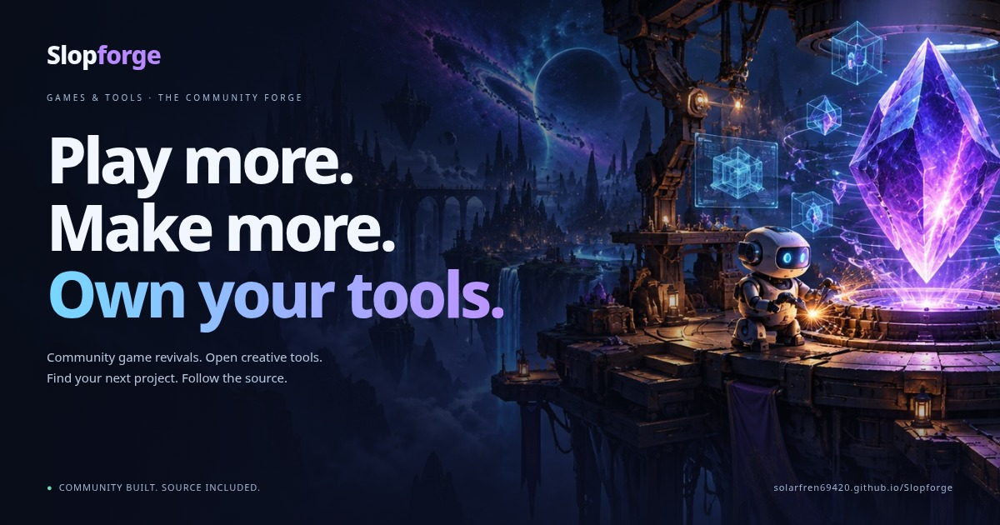

<p align="center"><a href="https://solarfren69420.github.io/Slopforge/"></a></p>

# Slopforge

**Play more. Make more. Own your tools.**

A community forge for game revivals, original open-source games, creative software, engines, compatibility layers, and reverse engineering tools. Find a project that matters to you, meet its maintainers, and follow the source.

[**Explore Slopforge →**](https://solarfren69420.github.io/Slopforge/) · [Project catalog](CATALOG.md) · [Activity & review queue](https://solarfren69420.github.io/Slopforge/activity.html) · [Submit a project](https://github.com/solarfren69420/Slopforge/issues/new?template=add-project.yml) · [Submission inbox](https://github.com/solarfren69420/Slopforge/issues) · [Suggest a correction](https://github.com/solarfren69420/Slopforge/issues/new?template=correction.yml)

<!-- catalog-stats:start -->
**49 projects** · 15 games · 34 tools & software
<!-- catalog-stats:end -->

## The storefront

Blue for games. Purple for tools. One place to find your next rabbit hole.

- **Discover:** curated shelves of game revivals, ArtCraft's Crafting Apps, creative tools, original games, and projects that work under the hood.
- **Games:** community engines and source ports alongside independently developed open-source games.
- **Tools:** digital art, 3D, CAD, audio, video, mapping, electronics, office software, game engines, compatibility, and code analysis.
- **My library:** save projects with the heart button. Favorites stay in your browser; no account is required.
- **Search and filters:** find names, repositories, descriptions, technologies, categories, methods, platforms, and tags. Press `/` to search. Filter combinations and individual project links can be shared.
- **Project details:** see the project type, data requirements, upstream link, review date, and scope notes before heading upstream.

Every project has a direct GitHub link. Where GitHub is a mirror or a project hub, the details identify the primary development location. Repository names and platform families are metadata, not an assertion that Slopforge has built or tested the software.

## What belongs in the forge?

| Project label | What it means here |
| --- | --- |
| Reimplementation | An engine implementation intended to reproduce a classic game's behavior. This is not a binary matching or completion claim. |
| Clean-room rewrite | Upstream describes an application rebuilt from observed behavior and public information. The label attributes the maintainer's methodology claim; Slopforge has not independently audited the clean-room process or established complete feature parity. |
| Source-available tool | Publicly inspectable source under custom terms that may restrict reuse. Read the upstream license; this label is distinct from an open-source license. |
| Source port | An adaptation of an existing source engine for modern systems and features. |
| Original open-source game | A separately developed open-source game with its own upstream licensing. |
| Game creation platform / game engine | Software for building games or running community-created game projects. |
| Independent open-source tool | Independently developed creative or professional software. It is not labeled as a decompilation of a commercial application. |
| Compatibility layer | Software that implements or translates APIs. Support depends on applications, drivers, versions, and configuration. |
| Reverse engineering tool | Software for analyzing code. Its output alone does not establish a working or complete reconstruction. |

Krita, Blender, FreeCAD, LibreOffice, and the other independent tools are listed under their own names and repositories. Slopforge does not imply that they are reconstructed copies of Photoshop, AutoCAD, Excel, or other proprietary products. The blueprint's fictional game titles and numerical scores are not used as factual catalog entries.

**BYOD** means the project needs separately obtained game data; upstream may document legally distributed free or shareware options. **Experimental** identifies development-stage work. Other tags describe upstream-documented capabilities, not a test performed by this directory.

## ArtCraft & the Crafting Apps

Added **2026-10-07** after reviewing [Storytold / ArtCraft](https://github.com/storytold)'s public repository inventory, commit-pinned READMEs, license files, and development qualifications. Use the [ArtCraft collection](https://solarfren69420.github.io/Slopforge/?view=tools&tag=ArtCraft) or the **Rust rewrite** tag on the storefront. Individual details link the reviewed source snapshots.

| Application | Upstream-described workflow |
| --- | --- |
| [PhotoCraft](https://github.com/storytold/photocraft) | Photoshop-style image editing |
| [LightCraft](https://github.com/storytold/lightcraft) | Lightroom-style photo management and raw development |
| [FilmCraft](https://github.com/storytold/filmcraft) | Premiere Pro-style video editing |
| [VectorCraft](https://github.com/storytold/vectorcraft) | Illustrator-style vector illustration |
| [EffectCraft](https://github.com/storytold/effectcraft) | After Effects-style motion graphics and compositing |
| [DesignCraft](https://github.com/storytold/designcraft) | InDesign-style page layout and publishing |
| [PrintCraft](https://github.com/storytold/printcraft) | Acrobat-style PDF workflows |
| [CADCraft](https://github.com/storytold/cadcraft) | AutoCAD-style drafting |
| [SoundCraft](https://github.com/storytold/soundcraft) | Pro Tools-style audio production |
| [GridCraft](https://github.com/storytold/gridcraft) | Excel-style spreadsheets |
| [WordCraft](https://github.com/storytold/wordcraft) | Word-style documents |
| [DeckCraft](https://github.com/storytold/deckcraft) | PowerPoint-style presentations |

These twelve applications describe themselves as clean-room Rust reimplementations and publish MIT OR Apache-2.0 code licensing. Their bundled assets and branding have separate terms. The original commercial product names identify the intended workflows, not an official product, endorsement, or guaranteed replacement.

Development stages and limitations are recorded per application: PhotoCraft is early alpha; CADCraft and DeckCraft are in early development; SoundCraft and GridCraft are pre-alpha. Other applications also document incomplete workflows or ongoing development. Feature-checklist estimates are not imported as completion scores.

[ArtCraft Studio](https://github.com/storytold/artcraft) is also listed, under **Source-available tool**. Its [custom fair-source license](https://raw.githubusercontent.com/storytold/artcraft/3e5793b6934b51536606720e5d56bcfd1fe7cc2d/LICENSE.md) includes reuse restrictions; it does not share the Crafting Apps' MIT/Apache-2.0 terms. Generative workflows can use online providers and paid services.

The [review records](data/storytold-review.json) preserve reviewed commits, source URLs, hashes, and inventory decisions. Supporting infrastructure, test corpora, media repositories, forks, and unclassified prototypes are not added as standalone applications. Slopforge did not build these applications, inspect every source file, or audit their claimed clean-room provenance.

## Files, attribution, and licensing

Slopforge hosts its own website code, original branding and symbolic card artwork, and catalog metadata. It does **not** host ROMs, proprietary game assets, original executables, leaked source, cracks, activation bypasses, or game downloads. Obtain required data legally and follow each upstream project's instructions and licenses.

The forge banner is original AI-generated mood artwork, created with the built-in image generation tool. The SVG cards are original symbolic illustrations generated by this site's code; they are not screenshots of the listed projects. Project names identify their respective upstream projects. Slopforge is independent and does not claim affiliation with original publishers or upstream maintainers.

[Content policy](CONTENT_POLICY.md) · [Original artwork notes and prompt](ARTWORK.md) · [Website code license](LICENSE)

## A sibling, with its own purpose

[Game Decompilation Library](https://solarfren69420.github.io/GameDecompLibrary/) focuses on source reconstruction, method evidence, and carefully scoped progress reports. Slopforge borrows its commitment to clear labels, upstream attribution, easy submissions, and maintainable records, then builds a separate storefront around discovering games and tools. No progress figures are imported from that library.

## Add or update a project

Submit an [addition](https://github.com/solarfren69420/Slopforge/issues/new?template=add-project.yml), report a [correction](https://github.com/solarfren69420/Slopforge/issues/new?template=correction.yml), or open a pull request. **Submissions create GitHub issues in [this inbox](https://github.com/solarfren69420/Slopforge/issues); a GitHub account is required.** The checker validates the upstream repository, flags duplicates, and opens a draft PR for each new valid repository. The form collects the listing details; missing information is shown in the PR and can be supplied by editing the form.

**Maintainer approval takes one checkbox:** open the linked PR, review its proposed listing, and tick **Approve and publish this reviewed listing**. The publication workflow verifies your write access, generates the catalog entry/README/catalog page/original artwork, runs catalog and browser tests, and merges/deploys the PR. Failed or incomplete proposals remain unmerged. No artifact download or local JSON editing is required. The bot does not publish anything without a maintainer's approval. GitHub's **Allow GitHub Actions to create and approve pull requests** repository setting must be enabled for automatic PR creation.

The catalog lives in [`data/projects.json`](data/projects.json). Keep one entry per upstream repository. Include a short description, accurate method label, data requirements, platform families, source notes, review date, and relevant tags. Prefer the original maintainer's repository. Explain mirrors, early development, and requirements explicitly. Do not invent completion percentages, star counts, compatibility guarantees, or endorsements.

After editing, regenerate the catalog page, counts, and original card art:

```sh
python3 scripts/build.py --update-docs
python3 -m unittest discover -s tests -v
node --check web/app.js
```

Commit the JSON and generated documentation/card changes together. Counts are text generated from data; the branding has no fixed totals to become stale.

## Run locally

The website has no runtime framework, database, API key, tracking script, or external font dependency. Python's standard library builds the static site.

```sh
git clone https://github.com/solarfren69420/Slopforge.git
cd Slopforge
python3 scripts/build.py
python3 -m http.server 8080 --directory _site
```

Open `http://localhost:8080`. Use an HTTP server because the catalog is loaded with `fetch`.

Optional browser verification uses Playwright:

```sh
npm install
npx playwright install chromium
SLOPFORGE_URL=http://localhost:8080 node tests/browser.cjs
```

Set `CHROME_PATH` to use an existing Chrome binary. Browser checks cover the catalog, filters, saved favorites, shared links, dialogs, keyboard behavior, and mobile overflow. Local screenshots are ignored under `test-results/`.

## GitHub Pages

The workflow [Build and deploy Slopforge](.github/workflows/pages.yml) validates the catalog, builds `_site/`, and runs Chromium browser tests before publishing on pushes to `main`. Pull requests run the same checks without deployment. Browser evidence is kept for 14 days. In repository **Settings → Pages**, the publishing source is **GitHub Actions**.

Website: **https://solarfren69420.github.io/Slopforge/**

The site includes Open Graph and Twitter card metadata pointing to [`social-preview.jpg`](web/assets/social-preview.jpg). GitHub's repository social preview is a separate setting: upload this same image under **Settings → General → Social preview** to replace GitHub's default language-color preview. Committing the image does not set that repository preference.

## Automated maintenance

[Weekly upstream checks and discovery](.github/workflows/maintenance.yml) runs Tuesdays at **15:23 UTC / 8:23 a.m. Arizona time**, or manually through Actions. GitHub may delay scheduled runs. It checks all listed repositories for moves, archival/disabled status, latest non-prerelease releases, and README/root-license file changes. Successful check dates are separate from human review dates; an API failure preserves the last successful baseline and is reported for attention.

Discovery scans the organizations and bounded topic/keyword searches in [`data/automation-config.json`](data/automation-config.json), excludes existing listings/forks/archived repos, and preserves a deduplicated candidate queue. Search coverage is not exhaustive, and discovery candidates are not approved listings. A weekly bot issue in the [Issues inbox](https://github.com/solarfren69420/Slopforge/issues) collects results. Observations persist on the `automation/state` branch, and the workflow rebuilds the public [activity page](https://solarfren69420.github.io/Slopforge/activity.html) and per-project check details after each scan.

Automation uses GitHub Actions' built-in token, with no personal API key or visitor tracking. It does not automatically approve projects, change reviewed descriptions/licenses, or update human review dates. See [AUTOMATION.md](AUTOMATION.md) for configuration, draft review, limitations, and recovery.

## Review scope

The initial catalog was reviewed against upstream repository pages on **2026-10-05** for identity and basic purpose. The ArtCraft additions were reviewed separately on **2026-10-07**, as documented above. Data requirements and mirror/development notes are included per entry. The optional live link checker records reachable repositories and README hashes; successful retrieval is not proof of correctness or completeness. Source bodies are not redistributed in this repository.

Slopforge does not build, execute, certify, or gameplay-test cataloged upstream software. Platform filters describe upstream-listed operating-system families; versions, release packages, driver support, and setup may change. Follow the upstream README for the current details. Slopforge's own build and interactive storefront are checked separately.
